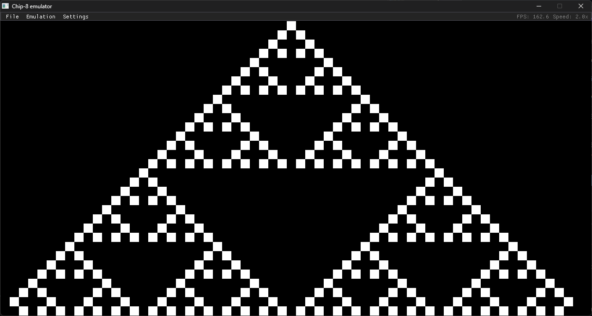

# Chip-8 emulator

A [chip-8](https://en.wikipedia.org/wiki/CHIP-8) emulator written in C++ using SDL3 and ImGui.



---

### Usage
```
chip8_emu [ROM_FILE]
```

---

### Compiling
Install a C compiler, [cmake](https://cmake.org/) and [SDL3](https://github.com/libsdl-org/SDL/blob/main/INSTALL.md), then run:
```
cmake -B buid
cmake --build build
```
Your executable will be in the *build* folder.
